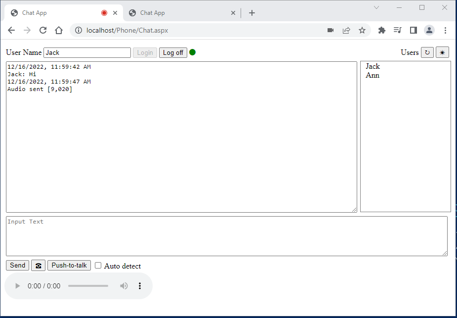
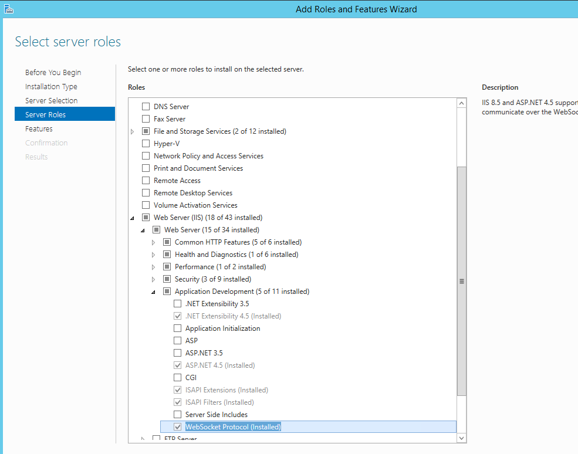

# Phone Chat with Web Sockets
Attempt to create a Phone chat application using Web Sockets

Originally posted here: https://www.codeproject.com/Articles/5349792/Phone-Chat-with-Web-Sockets

## Introduction
This application is my attempt to create a smallest voice chat application using Web Sockets and MediaRecorder. Web Sockets is the technology that lets you push the data from the web server to web browser. The MediaRecorder JavaScript object provides functionality to easily record media.

You can send a voice message using Push-to-talk button or by using "Auto detect" feature to send voice data as you speak using WebAD library. The send button sends text message. The ring button rings all of the logged in users.

## Background
To use Web Sockets, your web server needs to have ASP.NET 4.5 or higher and WebSocket Protocol installed under Add Roles and Features > Server Roles > Web Server > Web Server > Application Development > WebSocket Protocol.

To setup the allocation, unzip Phone.zip to a C:\inetpub\wwwroot\Phoneon your web server. Open IIS Console and create virtual directory called Phone.

## Using the Code

Next, point your browser to http://localhost/Phone/Chat.aspx.

The web allocation has two files: Handler1.ashx and Chat.aspx. Handler1.ashx handler file handles WebSockets request. It handles web socket request with HandleSocketRequest function. The Async function loops if the socket connection is opened. It uses Await to wait for the message and then broadcasts the massage to all the registered users.

Chat.aspx file lets you login and broadcast message to all connected users. It is an ASP.NET web form that get the list of active users and uses JavaScript to send massage to Handler1.ashx.

Chat.js file is the JavaScript file for Chat.aspx.

The application does not let you send voice to iPhone/iPad from Android or Windows because Apple does not support webM format. iPhone/iPad plays wav, mp3 or mp4. So the next step is to try using Wave Recorder instead of MediaRecorder.
